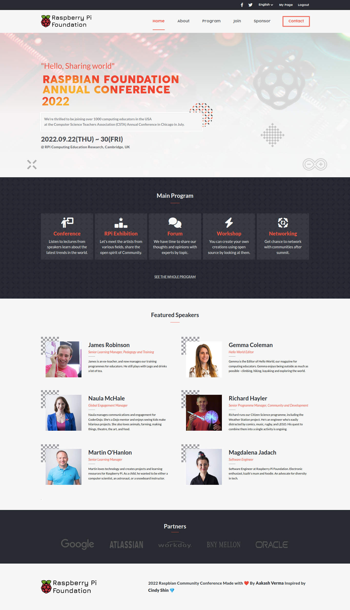
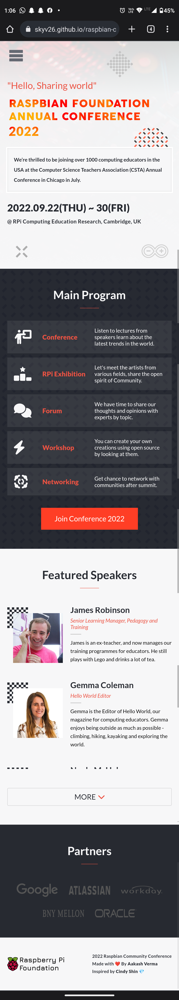

# Project Name

> **The Raspbian Community Conference is a brand-new event led by the Raspberry Pi Foundation with lots of help from our community of young people, educators, hobbyists, and tech enthusiasts. It will be a chance for people of all ages and skill levels to have a go at getting creative with tech, as well as a celebration of all that our digital makers have already learnt and achieved, whether through taking part in Code Clubs, CoderDojos, or Raspberry Jams or through trying our resources at home.**

## Built With

- JavaScript ( ES6 )
- HTML5 ( A11y, Semantics )
- CSS3 ( Flexbox, Grid, Box-Model, Media Query )
- SASS Preprocessor ( SCSS )

## Live Demo

[**See Project 🚀**](https://skyv26.github.io/raspbian-community-conference/)

## Video Demonstration

[** Watch 😄 **](https://drive.google.com/file/d/1bbrmptcndV7PmcIQx2JRe9mSgtyVfCMH/view?usp=sharing)

## Screenshots 

## Getting Started

To get a local copy up and running follow these simple example steps. Please make sure on order to use the this project you need to install
`DART-SASS` compiler.

### Prerequisites

- In order to explore this repository, you must have a good knowledge on HTML5 - semantics, CSS3 and JavaScript with ES6.

### Setup

- Use the below command for taking clone this project

  `git clone https://github.com/skyv26/raspbian-community-conference.git`

### Install

- Make sure that you have already downloaded the `node` and `npm` on your system. If yes, then install the 
  packages by using below command.
  
  `npm i`

- Please install `sass compiler` if you want to use sass preprocessor.

### Usage

- You can simply use run-server vscode extension to run this website on your local browser.

- In order to compile the scss file to plain css. Use below command
  
  `sass --watch scss/style.scss:css/style.css`

### Run tests

I have added the linters or tests in order to avoid anykind of typos and ensure the good practices in this project. So while using this repository if you need to check your work no matters have worked on html, css and js you can use below commands

- In order to run the linter test on `index.html` or any html file. Use below command

  `npx hint .`

- To run linter test on stylesheets. Use below command

  `npx stylelint "**/*.{css,scss}"`

- To run linter test on javascript files. Use below command

  `npx eslint .`

### Deployment

This repo is actually deployed on the Github-Pages. In order to know more information on gh-pages
click [this](https://pages.github.com/) link

## Authors

👤 **Author1**

- GitHub: [@skyv26](https://github.com/skyv26)
- Twitter: [@vrma_aakash](https://twitter.com/vrma_aakash)
- LinkedIn: [@devaakash](https://www.linkedin.com/in/devaakash/)
- Frontend Mentor: [@skyv26](https://www.frontendmentor.io/profile/skyv26)

## 🤝 Contributing

Contributions, issues, and feature requests are welcome!

Feel free to check the [issues page](../../issues/).

## Show your support

Give a ⭐️ if you like this project!

## Acknowledgments

For Design Inspiration I would like to Acknowledge
<a href="https://www.behance.net/adagio07" rel="noopener" target="_blank"><strong>Cindy Shin</strong></a> ❤️

## 📝 License

This project is [MIT](./LICENSE) licensed.
